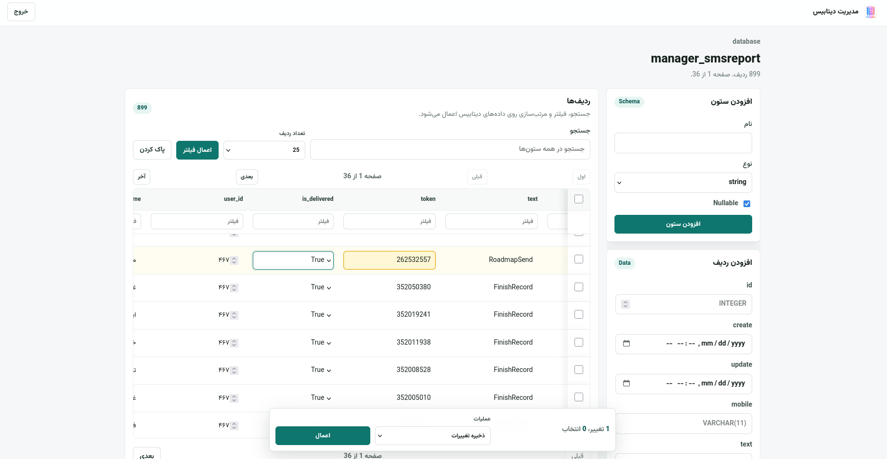

# Database Manager

A simple form-based FastAPI database manager for PostgreSQL, MySQL, and MariaDB. It provides short-lived signed-cookie sessions, username/password login, optional TOTP verification, and basic CRUD screens for configured databases, tables, columns, and rows.



## Features

- FastAPI with Jinja2 templates and static CSS.
- Login from environment variables.
- Optional SHA-256 password hash support via `BACKUP_HUB_PASSWORD_HASH`.
- Optional TOTP verification via `BACKUP_HUB_TOTP_SECRET`.
- Short-lived, signed, HTTP-only session cookie.
- PostgreSQL, MySQL, and MariaDB connections from `.env`.
- Database list is controlled by `POSTGRES_DATABASES`, `MYSQL_DATABASES`, and `MARIADB_DATABASES`.
- Form-based CRUD for databases, tables, columns, and rows.
- SQL injection controls: identifier allowlist validation, dialect-aware identifier quoting, allowlisted column types, and bound parameters for row values.

## Quick Start

```bash
cp .env.example .env
python -m venv .venv
source .venv/bin/activate
pip install -r requirements.txt
uvicorn main:app --host 0.0.0.0 --port 2525
```

Open `http://localhost:2525` for local development, or `http://localhost` when running the Docker image with the production port mapping below.

For local HTTP usage, keep `BACKUP_HUB_COOKIE_SECURE=NO`. Use `YES` only behind HTTPS.

## Docker

```bash
docker build -t database-manager .
docker run --env-file .env -p 80:80 database-manager
```

When running in Docker, database hosts must be reachable from inside the container. Use a Docker network or hostnames from your compose stack.

## Database Configuration

Only databases named in `*_DATABASES` are shown in the UI. Use comma-separated names:

```env
POSTGRES_DATABASES=app_db,analytics_db
MYSQL_DATABASES=legacy_db
MARIADB_DATABASES=reports_db
```

After changing `.env`, restart the application. Creating a database from the UI does not rewrite `.env`; add the new database name to the matching `*_DATABASES` variable if it should appear on the dashboard after restart.

## Table Creation Format

The create-table form accepts one column per line:

```text
id:integer:notnull:pk
name:string:notnull
notes:text
created_at:datetime
```

Format: `name:type:nullable:pk`.

Allowed types: `string`, `text`, `integer`, `bigint`, `decimal`, `boolean`, `date`, `datetime`.

## Security Notes

- Put strong secrets in `.env`; do not commit real `.env` files.
- Use a long random `BACKUP_HUB_SESSION_SECRET` in production. The app requires at least 32 characters for signed session and CSRF tokens.
- Prefer `BACKUP_HUB_PASSWORD_HASH` over plain `BACKUP_HUB_PASSWORD` when possible.
- Enable HTTPS and `BACKUP_HUB_COOKIE_SECURE=YES` in production.
- Grant the database user only the permissions this tool needs.
- Authenticated POST actions are protected with CSRF tokens and baseline security headers are set on every response.
- Destructive actions such as drop database/table/column are available in the UI.

To generate a TOTP secret:

```bash
python -c "import pyotp; print(pyotp.random_base32())"
```

To generate a password hash compatible with `BACKUP_HUB_PASSWORD_HASH`:

```bash
python -c "import hashlib, getpass; print(hashlib.sha256(getpass.getpass().encode()).hexdigest())"
```

## Environment Variables

| Variable | Required | Default | Description |
| --- | --- | --- | --- |
| `DEBUG` | No | `NO` | Enables FastAPI debug mode when truthy. |
| `PORT` | No | `80` | Application port for Docker and production. |
| `BASE_URL` | No | `http://localhost` | Public base URL for documentation or deployment metadata. |
| `CORS_ALLOWEDS` | No | empty | Comma-separated allowed origins, reserved for API extension. |
| `TZ` | No | `Asia/Tehran` | Container timezone used by Debian tzdata and application runtime. |
| `BACKUP_HUB_SERVER_KEEP_ALIVE_SECONDS` | No | `120` | Uvicorn keep-alive timeout used by the Docker CMD. |
| `BACKUP_HUB_USERNAME` | Yes | `admin` | Login username. |
| `BACKUP_HUB_PASSWORD` | Yes if no hash | empty | Plain password fallback. |
| `BACKUP_HUB_PASSWORD_HASH` | No | empty | SHA-256 hex digest. Takes precedence over plain password. |
| `BACKUP_HUB_TOTP_SECRET` | No | empty | Base32 TOTP secret. Empty disables TOTP verification. |
| `BACKUP_HUB_SESSION_SECRET` | Yes | empty | Secret key for signing session cookies. Use at least 32 random characters. |
| `BACKUP_HUB_SESSION_COOKIE` | No | `dbm_session` | Session cookie name. |
| `BACKUP_HUB_COOKIE_SECURE` | No | `YES` | Set `YES` for HTTPS only, `NO` for local HTTP. |
| `BACKUP_HUB_SESSION_TTL_SECONDS` | No | `900` | Session lifetime in seconds. |
| `BACKUP_HUB_LOGO_URL` | No | `/static/img/logo.png` | Logo URL shown in the UI. |
| `BACKUP_HUB_FAVICON_URL` | No | `/static/img/favicon.ico` | Favicon URL. |
| `POSTGRES_HOST` | Required for PostgreSQL | empty | PostgreSQL host. |
| `POSTGRES_PORT` | No | `5432` | PostgreSQL port. |
| `POSTGRES_USER` | Required for PostgreSQL | empty | PostgreSQL username. |
| `POSTGRES_PASSWORD` | Required for PostgreSQL | empty | PostgreSQL password. |
| `POSTGRES_DATABASES` | No | empty | Comma-separated PostgreSQL databases to show. |
| `MYSQL_HOST` | Required for MySQL | empty | MySQL host. |
| `MYSQL_PORT` | No | `3306` | MySQL port. |
| `MYSQL_USER` | Required for MySQL | empty | MySQL username. |
| `MYSQL_PASSWORD` | Required for MySQL | empty | MySQL password. |
| `MYSQL_DATABASES` | No | empty | Comma-separated MySQL databases to show. |
| `MARIADB_HOST` | Required for MariaDB | empty | MariaDB host. |
| `MARIADB_PORT` | No | `3306` | MariaDB port. |
| `MARIADB_USER` | Required for MariaDB | empty | MariaDB username. |
| `MARIADB_PASSWORD` | Required for MariaDB | empty | MariaDB password. |
| `MARIADB_DATABASES` | No | empty | Comma-separated MariaDB databases to show. |
